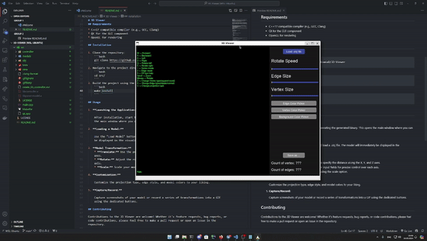
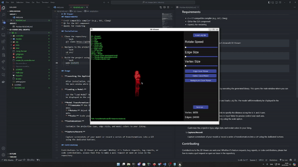
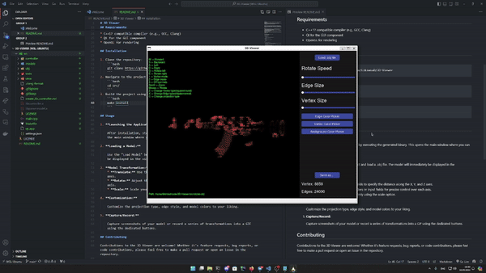
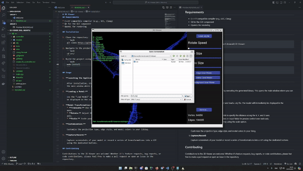

# 3D Viewer


## Introduction

The 3D Viewer is a cutting-edge program developed in C++17 for visualizing 3D wireframe models with high performance and flexibility. Designed with user interaction in mind, it supports various transformations such as translation, rotation, and scaling, making it an indispensable tool for developers, designers, and enthusiasts in the 3D modeling community.

## Features

* **High Compatibility:** Load models from `.obj` files, supporting vertices and surfaces list.
* **Dynamic Transformations:** Translate, rotate, and scale models in real-time.
* **Custom GUI Implementation:** Utilize libraries like Qt for an intuitive graphical interface, enabling easy manipulation of 3D models.
* **Performance Optimized:** Smoothly handles models with details up to 1,000,000 vertices without significant performance drops.
* **Extensive Customization:** Adjust projection type, edge style, color, thickness, and more to suit your preferences.
* **Persistent Settings:** Save your settings between program restarts for a personalized experience.
* **Capture and Record:** Save screenshots in multiple formats and record transformations into GIF animations.

## Requirements

* C++17 compatible compiler (e.g., GCC, Clang)
* Qt for the GUI component
* OpenGL for rendering

## Installation

1. Clone the repository:
    ```bash
    git clone https://github.com/LikimiaD/3D-Viewer
    ```
2. Navigate to the project directory:
    ```bash
    cd src/
    ```
3. Build the project using the Makefile:
    ```bash
    make install
    ```

## Usage

1. **Launching the Application:**
  
    After installation, start the 3D Viewer by executing the generated binary. This opens the main window where you can interact with the program.

2. **Loading a Model:**
    
    Use the "Load Model" button to select and load a .obj file. The model will immediately be displayed in the visualization area.

    

3. **Model Transformation:**
    * **Translate:** Use the provided fields to specify the distance along the X, Y, and Z axes.
    * **Rotate:** Adjust the rotation sliders or input fields for precise control over each axis.
    * **Scale:** Scale your model uniformly using the scale option.

      

4. **Customization:**

    Customize the projection type, edge style, and model colors to your liking.

      

5. **Capture/Record:**

    Capture screenshots of your model or record a series of transformations into a GIF using the dedicated buttons.

      

## Contributing

Contributions to the 3D Viewer are welcome! Whether it's feature requests, bug reports, or code contributions, please feel free to make a pull request or open an issue in the repository.

## License

This project is licensed under the MIT License - see the [LICENSE](LICENSE) file for details.